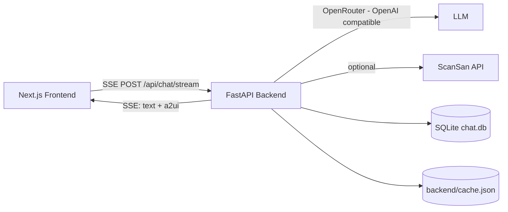
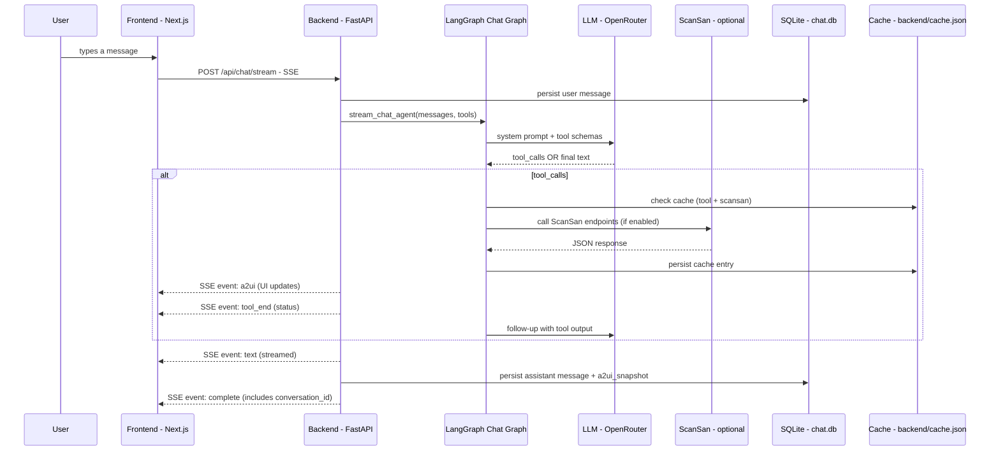
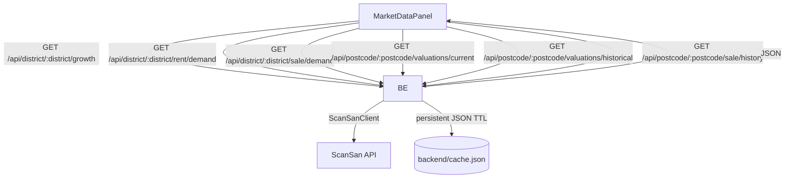
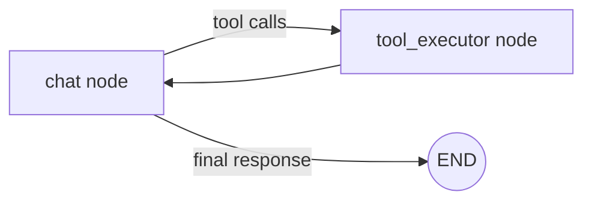

# JARZ-AI (RentRadar) — Spatio‑Temporal Rental Valuation (Hackathon)

RentRadar is a **chat-first UK property assistant**. You type questions, the agent calls tools (market data, listings, valuation/investment calculations), and the UI updates live via **A2UI** streamed over **SSE**.

## Architecture (at a glance)



More diagrams and flows: `docs/architecture.md`

## System diagrams

### Data flow (chat + tools + UI streaming)



### Data flow (Market Data tab)



### LangGraph flow (chat agent loop + tool calls)



## Key features

- **Chat + streaming UI**: assistant text + UI updates stream live (SSE).
- **A2UI (Agent→UI)**: the agent can render charts/cards/tables on the right panel.
- **Market Data tab**:
  - growth trend (district)
  - rent demand + sales demand (district)
  - current + historical valuations (postcode)
  - sale history table + export (postcode)
- **Property Finder**: rent + sale listings, optional Mapbox map view.
- **Location comparison**: compare 2–3 locations (summary + ranges + listings).
- **Profile personalization**: user profile is injected into the system prompt.
- **Demo‑grade caching**: tool + ScanSan responses cached to `backend/cache.json` (persists across restarts).
- **Chat history persistence**: SQLite (`backend/app/chat.db` by default) with UI snapshot replay.

## Repo layout

- `run.ps1`: one-command **install + run** script for judges (Windows/PowerShell)
- `backend/`: FastAPI + LangGraph + caching + SQLite history
  - `backend/app/main.py`: API routes (chat stream, market data, conversations)
  - `backend/app/agent/`: LangGraph graphs/nodes/state + tools
  - `backend/app/scansan_client.py`: ScanSan client + persistent API caching
  - `backend/app/cache.py`: persistent JSON TTL cache (`backend/cache.json`)
  - `backend/app/db.py`: SQLite chat history (`backend/app/chat.db`)
- `frontend/`: Next.js app (chat + A2UI renderer + tabs)
  - `frontend/app/page.tsx`: main layout + tab navigation
  - `frontend/hooks/useChatStream.ts`: SSE client + A2UI state
  - `frontend/components/A2UIRenderer.tsx`: A2UI component registry
- `api-1.json`: ScanSan OpenAPI spec used as a data source reference
- `notebooks/train_model_explained.ipynb`: maths + ML pipeline explanation (with plots)
- `models/`, `investment_model/`: model development docs/code
- `docs/`: architecture + API reference docs
- `AGENTS.md`: teammate/coding-agent rules to avoid breaking the demo

## Quickstart (Windows / PowerShell) — judges-friendly

### Prereqs

- Python **3.11 or 3.12 recommended**
  - Python 3.14 may show dependency warnings (some libs still catching up).
- Node.js **18+**

### 1) Configure environment

Backend:

```powershell
copy backend\.env.example backend\.env
notepad backend\.env
```

Frontend:

```powershell
copy frontend\.env.example frontend\.env.local
notepad frontend\.env.local
```

Optional map view: see `frontend/MAPBOX_SETUP.md`.

### 2) Install + run everything

```powershell
.\run.ps1
```

This script will:
- create a python venv (if missing) + `pip install -r requirements.txt`
- run `npm install` (if missing) + start Next.js
- start backend on `:8000` and frontend on `:3000`

Open: `http://localhost:3000`

## Demo scripts (copy/paste prompts)

- “What’s the rent forecast for `E14` over 12 months?”
- “Give me market data on postcode `NW1 0BJ`.”
- “Compare `NW1` vs `E14` and tell me which is better for renting out.”
- “Show me properties for rent in `SW1`.”
- “What’s the embodied carbon / sustainability picture for `SW1A 2AA`?”

## Maths / ML (from the notebook)

Full derivation + plots: `notebooks/train_model_explained.ipynb`

### Quantile regression (P10 / P50 / P90)

We predict quantiles to produce **uncertainty bands** instead of a single number.

Pinball (quantile) loss for quantile \(q\):

$$
\rho_q(u)=
\begin{cases}
q\cdot u & \text{if } u \ge 0 \\
(q-1)\cdot u & \text{if } u < 0
\end{cases}
$$

We train separate models for \(q \in \{0.1, 0.5, 0.9\}\) → **P10/P50/P90**.

### Spatial features (K nearest neighbors)

We capture neighborhood effects by averaging neighbor signals:

$$
\mathrm{spatial\_rent\_neighbor\_avg}=\frac{1}{K}\sum_{i=1}^{K}\mathrm{rent}_{i}
$$

### Explainability (SHAP)

We use SHAP to attribute how features (demand, growth, neighbor context, etc.) influence predictions.

## Data sources / APIs used

- **ScanSan API** (market + listings + valuations + sale history)
  - Docs: `https://docs.scansan.com/v1/docs`
  - OpenAPI spec (used for this repo’s references): `api-1.json`
  - Key endpoints we use are listed in `docs/api-reference.md`
- **OpenRouter** (LLM provider; OpenAI-compatible)
  - API: `https://openrouter.ai/`
- **Mapbox** (optional map view in Property Finder)
  - Setup: `frontend/MAPBOX_SETUP.md`

## Caching + persistence (hackathon stability)

- **Chat history**: persisted to SQLite (`backend/app/chat.db`)
- **Cache**: persisted to JSON (`backend/cache.json`)
  - speeds up repeated tool calls and repeated ScanSan requests
  - survives backend restarts (great for demos)

## Contributing / teammate safety

Read `AGENTS.md` before making changes. It contains:
- the SSE contract (backend ↔ frontend)
- how to add tools to the LangGraph agent
- how to add new A2UI components and UI panels safely
- guardrails to avoid merge breakage during demo crunch
