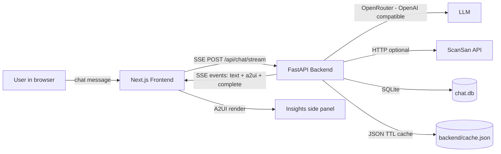
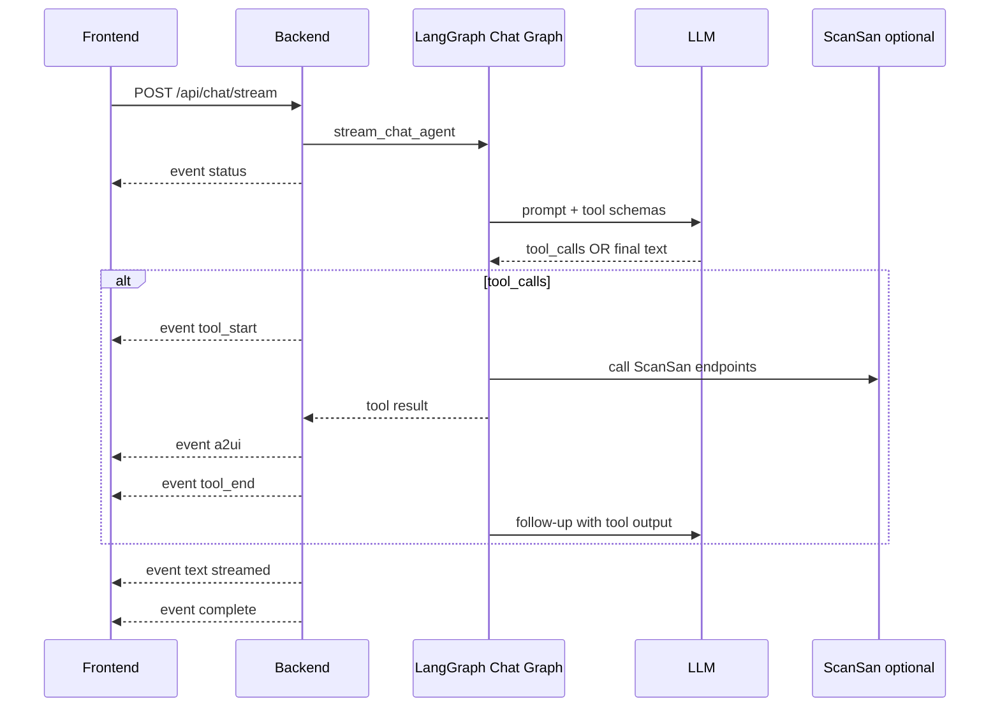
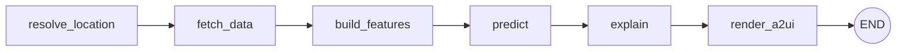
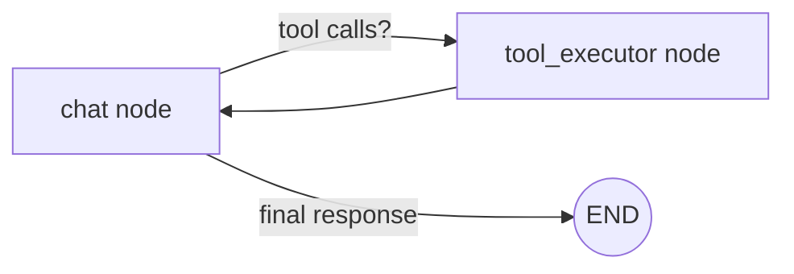
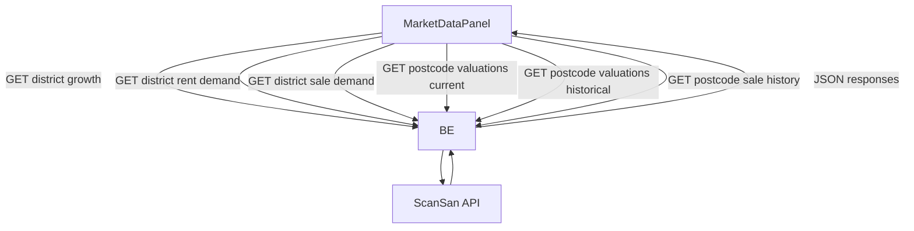

# Architecture (JARZ-AI / RentRadar)

This doc is intended for hackathon judges and teammates who want to understand **how the system works end-to-end**.

## High-level overview



## Runtime components

- **Frontend (Next.js)**: `frontend/`
  - Owns the UX: chat, sidebar tabs, A2UI renderer, charts, tables, maps.
  - Consumes **Server‑Sent Events (SSE)** from the backend so chat + UI updates stream live.

- **Backend (FastAPI + LangGraph)**: `backend/app/`
  - Exposes `/api/chat/stream` and other data endpoints.
  - Runs the **LangGraph chat agent** which can call tools.
  - Persists conversations/messages into SQLite.
  - Caches tool + ScanSan responses to disk for fast demos.

- **External services**
  - **OpenRouter** for LLM calls (OpenAI-compatible API).
  - **ScanSan** for property/market datasets (optional toggle via `USE_SCANSAN`).
  - **Mapbox** (optional) for Property Finder map view.

## Chat streaming (SSE) contract

The frontend expects **SSE frames** of the form:

```
event: <name>
data: <single-line JSON>

```

Event types used by the chat stream:



## LangGraph: what graphs exist

There are two flows in `backend/app/agent/graph.py`:

1. **Pipeline graph** (legacy valuation workflow): a linear chain:
   `resolve_location → fetch_data → build_features → predict → explain → render_a2ui`

2. **Chat graph** (main UX): loops tool calls as needed:
   `chat → (tool_executor → chat)* → end`

### Visual: pipeline graph



### Visual: chat graph (tool loop)



## Data-flow for market data tab

Market Data (growth/demand/valuations/sale history) is loaded via backend endpoints which proxy ScanSan and normalize/shape data for the UI:



## Persistence + caching

- **Chat history (SQLite)**: `backend/app/chat.db` by default
  - Conversations + messages are persisted so chat history survives reloads.
  - Assistant messages can include an `a2ui_snapshot` (so the side panel can be restored when reopening a conversation).

- **Cache (JSON TTL)**: `backend/cache.json`
  - Caches:
    - tool outputs (e.g. `tool:[...]`)
    - ScanSan raw API responses (prefixed `scansan:`)
  - Purpose: repeated demo actions become instant, even after backend restart.

